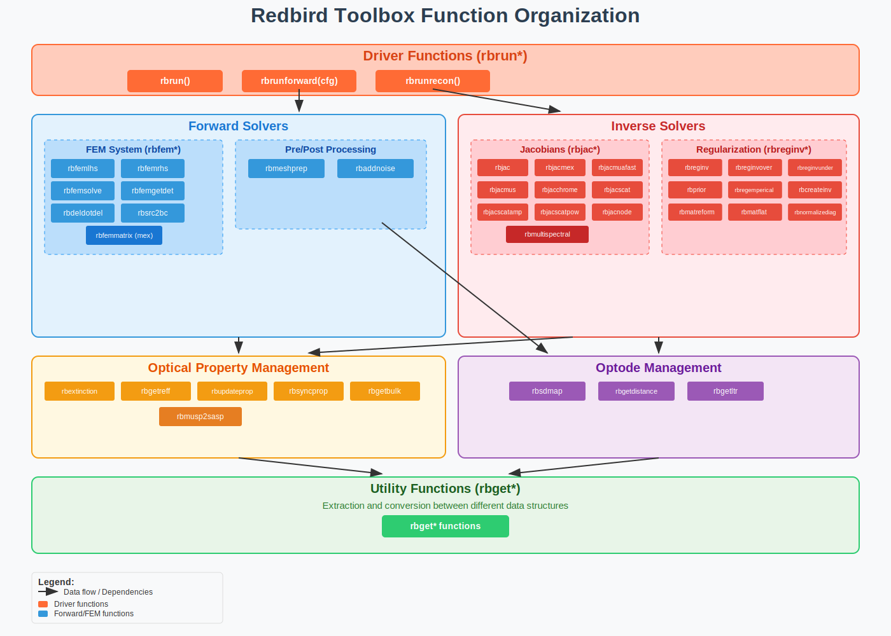
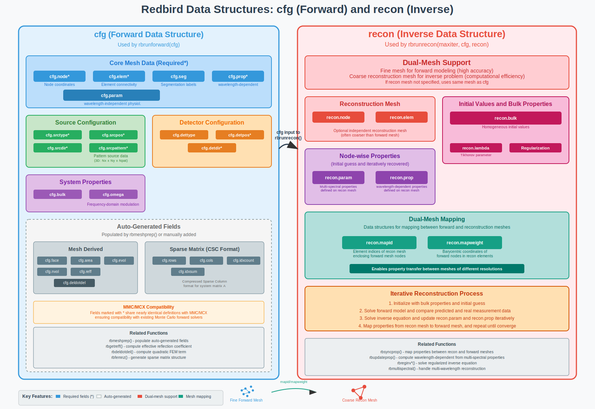

# Redbird - A Model-Based Diffuse Optical Imaging Toolbox

* **Copyright**: (C) Qianqian Fang (2005–2025) \<q.fang at neu.edu>, Edward Xu (2024) \<xu.ed at northeastern.edu>
* **License**: GNU Public License V3 or later
* **Version**: 0.5.1 (Northern Cardinal - Update 1)
* **GitHub**: [https://github.com/fangq/redbird](https://github.com/fangq/redbird)
* **Acknowledgement**: This project is supported by the US National Institute of Health (NIH)
  grant [R01-CA204443](https://reporter.nih.gov/project-details/10982160)

---


## Table of Contents
- [Introduction](#introduction)
- [How to Install](#how-to-install)
- [Workflow Overview](#workflow-overview)
- [How to Use](#how-to-use)
  - [Input Data Structure](#input-data-structure)
  - [Streamlined Forward and Inverse Solvers](#streamlined-forward-and-inverse-solvers)
    - [rbrun](#rbrun)
    - [rbrunforward](#rbrunforward)
    - [rbrunrecon](#rbrunrecon)
- [How to Cite](#how-to-cite)

---------

## Introduction

**Redbird** is a compact, portable, and feature-rich diffuse optical imaging (DOI) and diffuse optical tomography (DOT) toolbox for MATLAB and GNU Octave. It provides a fast, experimentally-validated forward solver for the diffusion equation using the finite-element (FE) method, along with advanced non-linear image reconstruction algorithms.

Redbird is the result of over two decades of active research in DOT and image reconstruction in Dr. Fang's lab. It has been the core data analysis tool in over a dozen journal publications related to optical breast imaging, prior-guided reconstruction techniques, multi-modal imaging, and wide-field DOT systems.

The forward solver is carefully validated against our widely used Monte Carlo (MC) solvers—**MCX** and **MMC**. The inverse solvers incorporate advanced reconstruction techniques and are designed for users across a wide spectrum of experience levels.

Techniques such as dual-mesh modeling, multi-spectral chromophore estimation, the adjoint method, structural-prior-guided reconstructions, block iterative solvers, and log-amplitude-phase reconstruction have their roots in the author's PhD dissertation and have been continuously improved over the years.

---

## How to Install

Installing Redbird is straightforward. After downloading and unzipping the toolbox, simply run `addpath()` in MATLAB or Octave:

```matlab
addpath('/path/to/redbird/matlab')
```

Replace `/path/to/redbird/matlab` with the actual unzipped folder path.

Although Redbird implements all core functionalities in native MATLAB code for portability, it includes a C-based MEX file, `rbfemmatrix.cpp`, to accelerate FE matrix and Jacobian computations. Precompiled `.mex` files are included for Linux, Windows, and macOS.

To rebuild the MEX file manually:

```matlab
mex rbfemmatrix.cpp
```

Or run `make mex` in the `redbird/matlab` folder using a terminal.

Redbird accepts tetrahedral mesh data from any mesh generator, but it integrates particularly well with our **iso2mesh toolbox**: [https://iso2mesh.sf.net](https://iso2mesh.sf.net). All scripts in the `example/` folder require iso2mesh.

---


## Workflow Overview

Redbird performs two main tasks:

* **Forward simulation**: Computes light distribution (fluence, in 1/mm²) across source-detector arrays within a mesh-based medium with known optical properties.
* **Image reconstruction** (inverse solution): Iteratively recovers 3D distributions of unknown optical properties by fitting forward simulations to measured data.

The Redbird forward solver is equivalent to our MC-based solvers like MCX and MMC, but it solves the **diffusion equation (DE)** instead of the more general **radiative transfer equation (RTE)**. As a result, Redbird is typically over 100× faster (without needing GPUs), and its outputs are free of stochastic noise.

**Note**: The diffusion approximation is only valid in high-scattering media, where the reduced scattering coefficient (μs') is much greater than the absorption coefficient (μa). Using Redbird in low-scattering media such as water or cerebrospinal fluid (CSF) may produce biased results.

---

### Reconstruction Modes

Redbird supports four types of image reconstructions:

1. **Bulk property fitting**: Estimates a single set of optical properties (bulk values) for the entire domain.
2. **Segmented reconstruction**: Estimates one set of properties per labeled tissue segment. Often called **"hard-prior"** reconstruction.
3. **Soft-prior reconstruction**: Incorporates spatial priors as soft constraints (e.g., from MRI or CT), enabling **compositional-prior** approaches.
4. **Unconstrained reconstruction**: Assumes each node/element has independent properties; solves via minimum-norm using **Tikhonov regularization**.

---

## Redbird function overview




Redbird functions are roughly divided into the following types, identified by the following prefixes:
- <font color=green>`rbrun*`</font> - "driver functions" that automatesa complex process, such as `rbrun()` for both forward/inverse solvers, or `rbrunforward()` and `rbrunrecon()`
- <font color=green>`rbfem*`</font> - FEM forward functions
- <font color=green>`rbjac*`</font> - functions related to building Jacobians
- <font color=green>`rbreginv*`</font> - functions related to building and regularizing the inverse equation
- <font color=green>`rbget*`</font> extraction and conversion between different data structures

Specifically, the main Redbird functions are divided into the following groups

* Streamlined forward/inverse solver interface <font color=orange>`rbrun`</font>
* Forward solvers
  - <font color=orange>`rbrunforward(cfg)`</font>  - streamlined forward solver
  - FEM system equation
      - `rbfemlhs` - creating the A-matrix (LHS) of the FEM system equation Ax=b
      - `rbfemrhs` - creating the right-hand-side (RHS) of the FEM system equation
      - `rbfemsolve` - linear solvers solving Ax=b
      - `rbfemgetdet` - extract fluence at detectors (point or widefield)
      - `rbfemmatrix.h/.c` - (optional) mex file for building the FEM forward matrix (fast), can be built using `mex rbfemmatrix.cpp` in MATLAB/Octave
      - `rbdeldotdel` - computing the quadratic term in the FEM equation
      - `rbsrc2bc` - converting wide-field source into the RHS vector
  - Pre and post-processing
      - `rbmeshprep` - mesh data preprocessing before forward modeling
      - `rbaddnoise` - add shot-noise or thermal noise to the simulated data
* Inverse solvers
  - <font color=orange>`rbrunrecon(cfg, recon, detphi0)`</font>  - streamlined inverse solver
  - Building Jacobians
    - `rbjac` - building Jacobians for mua/D
    - `rbjacmex` - building Jacobians for mua/D by calling `rbfemmatrix` mex file
    - `rbjacmuafast` - nodal-adjoint method for building mua Jacobian
    - `rbjacmus` - converting Jacobian for D to Jacobian for mus'
    - `rbjacchrome` - multi-spectral Jacobian for HbO/HbR/water/lipids/aa3 ...
    - `rbjacscat` - multi-spectral Jacobian for scattering amp/scattering power
    - `rbjacscatamp` - multi-spectral Jacobian for scattering amp
    - `rbjacscatpow` - multi-spectral Jacobian for scattering power
    - `rbmultispectral` - combining all multi-spectral Jacobians into a single equation
    - `rbjacnode` - convert from element-based Jacobian to node-based Jacobian
  - Solving and regularizing inverse equation
    - `rbreginv` - solving the Gauss-Newton Normal Equation with regularization
    - `rbreginvover` - solving the normal equation for over-determined system
    - `rbreginvunder` - solving the normal equation for under-determined system
    - `rbprior` - build the L^TL regularization matrix
    - `rbregemperical` - compute the emperical regularization factor
    - `rbcreateinv` - transform the inverse equation between 3 types
    - `rbmatreform` - transform the inverse matrix between 3 types
    - `rbmatflat` - combining multi-wavelength Jacobians into a flat matrix
    - `rbnormalizediag` - normalizing the inverse equation
* Optical property management
  - `rbextinction` - molar extinction coefficients for HbO, HbR, water, lipids, AA3 across visible/NIR wavelengths
  - `rbgetreff` - return the effective reflection coeff of the medium
  - `rbupdateprop` - using multi-spectral properties (`cfg.param`) to compute wavelength-dependent optical properties (`cfg.prop`)
  - `rbsyncprop` - mapping optical properties between recon mesh and forward mesh
  - `rbgetbulk` - get the bulk optical properties using forward structure `cfg`
  - `rbmusp2sasp` - use mus' at 2 wavelengths to compute scat_amp and scat_power
* Optode management
  - `rbsdmap` - create source/detector (SD) measurement list based on `cfg`
  - `rbgetdistance` - compute the source/detector distances
  - `rbgetltr` - get transport mean-free path for sinking the sources

---

## Data structures



### Forward data structure `cfg`

The forward solver in Redbird follows a very similar structure as those used by mcx and mmc (which are both forward solvers).

The `rbrunforward()` function takes in most of the simulation settings via the `cfg` struct input. This struct contains the following fields

- `cfg.node`*: node list of the mesh
- `cfg.elem`*: element list of the mesh
- `cfg.seg`: labels/segmentation in the mesh (similar to mmc's `cfg.elemprop`)
- `cfg.prop`*: wavelength-dependent optical properties
- `cfg.param`: wavelength-independent physiological properties (`cfg.param.{hbo,hbr,water,lipids,aa3,scatamp,scatpow}`)
- `cfg.srctype`*: source type `[pencil]`
- `cfg.srcpos`*: source array locations
- `cfg.srcdir`*: source directions
- `cfg.srcpattern`*: arrays of pattern source data (3D array: Nx*Ny*Npat)
- `cfg.dettype`: detector type `[pencil]`
- `cfg.detpos`*: detector array locations
- `cfg.detdir`*: detector directions
- `cfg.detpattern`*: arrays of pattern source data (3D array: Nx*Ny*Npat)
- `cfg.bulk`: bulk optical property
- `cfg.omega`: frequency-domain system modulation (angular) frequency in rad

properties marked with "*" share nearly identical definitions as in MMC (if exist, also in MCX).

The following extra inputs are derived from the above inputs - they can be automatically populated by running `rbmeshprep`, or manually added
- `cfg.face`: mesh exterior surface triangles
- `cfg.area`: areas of surface triangles
- `cfg.evol`: element volume
- `cfg.nvol`: nodal volume
- `cfg.reff`: effective reflective coeff (computed by `rbgetreff`)
- `cfg.deldotdel`: $\nabla\phi(r)\cdot\nabla\phi(r)$ - the quadratic term of the FEM equation, (computed by `rbdeldotdel`)
- `cfg.{rows,cols,idxcount}`: Redbird's FEM equation uses a Compressed Sparse Column (CSC) format to store the system matrix A, these are related to the sparse matrix columns returned by `rbfemnz`
- `cfg.idxsum`: the cumsum() of `cfg.idxcount`, i.e. the starting index of the non-zero terms for each node in the serialized vector

### Inverse data structure `recon`

The inverse solver, `rbrunrecon(cfg, recon, detphi0)` needs both the forward data structure `cfg`, and a new inverse data structure `recon` to store and manage the recovered optical properties. Redbird supports a technique called "dual-mesh", allowing one to use a fine mesh to perform forward solver for high accuracy, and another independent, often times much coarser, recon mesh to store the optical properties to reduce the inverse linear system size and accelerate reconstruction.

The inverse data structure `recon` contains the following fields
- `recon.node`: the node of the recon mesh (if ignored, recon uses the same mesh as in cfg.node/cfg.elem)
- `recon.elem`: the element of the recon mesh
- `recon.bulk`: homogeneous initial values for various optical properties (`recon.bulk.{mua,musp,dcoeff,n,g,hbo,hbr,scatamp,scatpower}`)
- `recon.param`: (node-wise) initial guess and the iteratively recovered multi-spectral optical properties defined on the recon mesh
- `recon.prop`: (node-wise) initial guess and the iteratively recovered wavelength-dependent optical properties defined on the recon mesh
- `recon.lambda`: Tikhonov regularization parameter
- `recon.mapid`: data structure mapping between recon and forward meshes: the list of element indices of the recon mesh where each forward mesh node is enclosed
- `recon.mapweight`: data structure mapping between recon and forward meshes: the barycentric coordinates of the forward mesh nodes inside the reconstruction mesh elements
Besides the forward `cfg`, the inverse solver `rbrunrecon()` requires a `recon` struct:

* `node`, `elem`: optional reconstruction mesh (typically coarser); enables **dual-mesh**
* `lambda`: Tikhonov regularization parameter
* `bulk`: initial guesses (single-wavelength: `mua`, `musp`, etc. or multi-spectral: `hbo`, `hbr`, etc.)
    * or `prop`: initial distribution of single-wavelength optical properties, with length matching that of `cfg.node` or `cfg.elem`
    * or `param`: initial distribution of multi-spectral optical properties, with length matching that of `cfg.node` or `cfg.elem`

---

## How to Use

### Streamlined forward and inverse solvers

#### `rbrun` 

`rbrun()` is the **all-in-one** interface to use redbird for forward and inverse modeling. It supports
several forms.

For example, the following one-liner
```
detphi0 = rbrun(cfg);
```
solves for the forward solution at all source/detector pairs (detphi0) using the `cfg` input, this
is the same as calling `detphi0 = rbrunforward(cfg)`, see below.

If 3 inputs are given, such as
```
newrecon = rbrun(cfg, recon, detphi0);
```
`rbrun` performs a reconstruction by fitting the measurement data stored in `detphi0` using the
forward data structure `cfg` and reconstruction data structures `recon`. This is the same
as `newrecon = rbrunrecon(cfg, recon, detphi0)`

If the 3rd input is a struct that resembles a forward cfg data structure,
```
newrecon = rbrun(cfg, recon, cfg0);
```
this performs a streamlined forward-simulation using `cfg0`, immediately followed by
a reconstruction using `cfg` and `recon`. This is equivallent to 
```
detphi0 = rbrunforward(cfg0);
newrecon = rbrunrecon(cfg, recon, detphi0);
```


#### `rbrunforward`

`rbrunforward` is the streamlined forward solver of redbird.

```
[detval, phi]=rbrunforward(cfg)
   or
[detval, phi, Amat, rhs]=rbrunforward(cfg,'param1',value1,...)

Perform forward simulations at all sources and all wavelengths based on the input structure

author: Qianqian Fang (q.fang <at> neu.edu)

input:
    cfg: the redbird forward simulation data structure
      The forward solver in Redbird follows a very similar structure as
      those used by mcx and mmc (which are both forward solvers).

      The rbrunforward() function takes in most of the simulation
      settings via the cfg struct input. This struct contains the
      following fields

	node*: node list of the mesh
	elem*: element list of the mesh
	seg: labels/segmentation in the mesh (similar to mmc's cfg.elemprop)
	prop*: wavelength-dependent optical properties
	param: wavelength-independent physiological properties
	      (cfg.param.{hbo,hbr,water,lipids,aa3,scatamp,scatpow})
	srctype*: source type [pencil]
	srcpos*: source array locations
	srcdir*: source directions
	srcpattern*: arrays of pattern source data (3D array: Nx*Ny*Npat)
	dettype: detector type [pencil]
	detpos*: detector array locations (3 column, without radius)
	detdir: detector directions
	detpattern: arrays of pattern detector data (3D array: Nx*Ny*Npat)
	bulk: bulk optical property
	omega: frequency-domain system modulation (angular) frequency in rad

      properties marked with "*" share nearly identical definitions as in
      MMC (if exist, also in MCX).

      The following extra inputs are derived from the above inputs -
      they can be automatically populated by running rbmeshprep, or
      manually added

	face: mesh exterior surface triangles
	area: areas of surface triangles
	evol: element volume
	nvol: nodal volume
	reff: effective reflective coeff (computed by rbgetreff)
	deldotdel: $\nabla\phi(r)\cdot\nabla\phi(r)$ - the quadratic term
	  of the FEM equation, (computed by rbdeldotdel)
	{rows,cols,idxcount}: Redbird's FEM equation uses a Compressed
	  Sparse Column (CSC) format to store the system matrix A, these
	  are related to the sparse matrix columns returned by rbfemnz
	idxsum: the cumsum() of cfg.idxcount, i.e. the starting index of
	  the non-zero terms for each node in the serialized vector

    one can also pass on the cfg data structure used by mcxlab or mmclab
    to rbrunforward. If rbrunforward detects cfg.nphoton and
    cfg.node/cfg.elem in the input, it calls mmclab and run forward
    simulations on both the source (cfg.srcpos) and detectors
    (cfg.detpos); if it sees cfg.nphoton and cfg.vol, then, rbrunforward
    calls mcxlab to run the forward simulation. mcxlab/mmclab can not
    handle frequency-domain simulations

output:
    detval: the values at the detector locations
    phi: the full volumetric forward solution computed at all wavelengths
    Amat: the left-hand-side matrices (a containers.Map object) at specified wavelengths
    rhs: the right-hand-side vectors for all sources (independent of wavelengths)
    param/value pairs: (optional) additional parameters
	 'solverflag': a cell array to be used as the optional parameters
	      for rbfemsolve (starting from parameter 'method'), for
	      example  rbrunforward(...,'solverflag',{'pcg',1e-10,200})
	      calls rbfemsolve(A,rhs,'pcg',1e-10,200) to solve forward
	      solutions
```

#### `rbrunrecon`

`rbrunrecon` is the streamlined inverse solver of redbird.

```
[newrecon, resid, newcfg]=rbrunrecon(cfg,recon,detphi0,sd)
  or
[newrecon, resid, newcfg]=rbrunrecon(maxiter,cfg,recon,detphi0,sd)
[newrecon, resid, newcfg, updates, Jmua, detphi, phi]=rbrunrecon(cfg,recon,detphi0,sd,'param1',value1,'param2',value2,...)

Perform a single iteration of a Gauss-Newton reconstruction

author: Qianqian Fang (q.fang <at> neu.edu)

input:
    cfg: simulation settings stored as a redbird data structure
    recon: reconstruction data structure, recon may have
	node: reconstruction mesh node list
	elem: reconstruction mesh elem list
	bulk: a struct storing the initial guesses of the param
	     (wavelength-independent optical properties) and prop
	     (wavelength-dependent optical properties), accepted
	     subfields include

	     mua/musp/dcoeff/n/g: used to initialize recon/cfg.prop
	     hbo/hbr/scatamp/scatpow: used to initialize recon/cfg.param
	param: wavelength-independent parameter on the recon mesh
	prop: wavelength-dependent optical properties on the recon mesh
	lambda: Tikhonov regularization parameter
	mapid: the list of element indices of the reconstruction mesh where each forward mesh
	  node is enclosed
	mapweight: the barycentric coordinates of the forward mesh nodes inside the
	  reconstruction mesh elements
    detphi0: measurement data vector or matrix
    sd (optional): source detector mapping table, if not provided, call
	rbsdmap(cfg) to compute
    param/value: acceptable optional parameters include
	'maxiter': number of iterations, default is 5
	'lambda': Tikhonov regularization parameter (0.05), overwrite recon.lambda
	'report': 1 (default) to print residual and runtimes; 0: silent
	'tol': convergence tolerance, if relative residual is less than
	       this value, stop, default is 0, which runs maxiter
	       iterations
	'reform': 'real': transform A*x=b so that A/x/b are all real
		  'complex': do not transform A*x=b
		  'logphase': transform Ax=b to [Alogamp,Aphase]*x=[log10(b),angle(b)]
	'mex': 0 (default) use matlab native code rbjac to build Jacobian
	       1: use mex-file rbfemmatrix to rapidly compute Jacobian
		 on forward (dense) mesh then interpolate to coarse mesh
	       2: call mex rbfemmatrix to build Jacobian directly on the
		  recon mesh (coarse).
	       setting mex to 2 gives the fastest speed (2x faster than 0)
	'prior': apply structure-prior-guided reconstruction,
	       supported methods include

	       'laplace': this is also known as the "soft-prior", where
		   the L matrix used in (J'J+lambda*L'L)dx=dy is a
		   Laplace smoothing matrix where l(i,j)=1 if i=j or
		   -1/N_seg if i~=j, where N_seg is the total number of
		   nodes/elems that are within each label or region;
		   recon.seg must be a vector of integer labels
	       'comp': use compositional-priors, recon.seg must be a
		   N-by-Nc matrix where N is the number of nodes, Nc is
		   the number of tissue compositions, each element in the
		   matrix must be a number between 0-1, denoting the
		   volume fraction of each composition; the row-sum must
		   be 1 for each node.

output:
    recon: the updated recon structure, containing recon mesh and
	 reconstructed values in recon.prop or recon.param
    resid: the residual betweet the model and the measurement data for
	 each iteration
    cfg: the updated cfg structure, containing forward mesh and
	 reconstructed values in cfg.prop or cfg.param
    updates: a struct array, where the i-th element stores the update
	 vectors for each unknown block
    Jmua: Jacobian in a struct form, each element is the Jacobian of an
	 unknown block
    detphi: the final model prediction that best fits the data detphi0
    phi: the final forward solutions resulting from the estimation
```
---

## How to cite

Many of the key algorithms in redbird have been initially developed by the author, Dr. Fang, 
between 2001 and 2005 and are described in details in his PhD dissertation

- Qianqian Fang, "Computational methods for microwave medical imaging," Ph.D. dissertation, Dartmouth College, Hanover, NH, 2004

While the initial software, code-named **white-dragon** written in FORTRAN90, was developed 
for the purpose of microwave tomography, a large portion of its workflow are directly
applicable to DOT, especially the inverse solvers. The only main difference is that white-dragon
solves the Helmholtz equation for microwave forward problem, while redbird solves for the
diffusion equation.

Between 2005 and 2007, Dr. Fang had extended white-dragon to DOT, and developed redbird in
FORTRAN90. During the following period, over a dozen DOT based papers were published based
upon computations using redbird-FORTRAN90. Specifically, the redbird software workflow
was specifically described in the following OSA/Optica conference proceeding in 2008

- Fang Q, et al., "A multi-modality image reconstruction platform for diffuse optical tomography," 
  in Biomed. Opt., BMD24 (2008). https://doi.org/10.1364/BIOMED.2008.BMD24

followed by a journal paper in 2009

- Fang Q, Carp SA, Selb J, Boverman G, Zhang Q, Kopans DB, Moore RH, Brooks DH, Miller EL, 
  Boas DA, "Combined optical Imaging and mammography of the healthy breast: optical contrast 
  derives from breast structure and compression," IEEE Trans. Medical Imaging, 
  vol. 28, issue 1, pp. 30 – 42, Jan. 2009.

The compositional-prior guided reconstructions have been published in the following series of papers
- Fang Q, Moore RH, Kopans DB, Boas DA, "Compositional-prior-guided image reconstruction algorithm 
  for multi-modality imaging," Biomedical Optics Express, vol. 1, issue 1, pp. 223-235, 2010.
- Deng B, Brooks DH, Boas DA, Lundqvist M, and Fang Q, "Characterization of structural-prior 
  guided optical tomography using realistic breast models derived from dual-energy x-ray mammography," Biomed. Opt. Express 6(7), 2366-2379, 2015

with an extension to this algorithm described in the following US patent
- Fang Q, "Method to localize small and high contrast inclusions in ill-posed model-based imaging modalities", US Patent US-11246529-B2, approved on 2022/02/15

The multi-spectral reconstruction was initially published in 
- Fang Q, Meaney PM, Paulsen KD, "Microwave image reconstruction of tissue property dispersion 
  characteristics utilizing multiple frequency information", IEEE Transactions on Microwave 
  Theory and Techniques, vol. 52, No. 8, pp. 1866-1875, Aug. 2004.

which had inspired and subsequently applied to DOT imaging by Shuba Srinivasan, a PhD student working in the same research team
- S. Srinivasan, B. W. Pogue, S. Jiang, H. Dehghani, and K. D. Paulsen, "Spectrally constrained 
  chromophore and scattering NIR tomography provides quantitative and robust reconstruction," Appl. Opt. 44, 1858–69 (2005).

Over the last two decades, redbird has been the underlying data analysis 
tool behind a list of DOT related publications from the author's lab, including

- Fang Q, Selb J, Carp SA, Kopans DB, Moore RH, Brooks DH, Miller EL, Boas DA, "Combined optical 
  and tomosynthesis breast imaging," Radiology, (cover article) vol. 258, No. 1, pp. 89-97, 2011.
- Deng B, Fradkin M, Rouet JM, Moore RH, Kopans DB, Boas DA, Lundqvist M, and Fang Q, "Characterizing 
  breast lesions through robust multi-modal data fusion using independent diffuse optical and x-ray 
  breast imaging," Journal of Biomed. Optics Letters, 20(8), 080502, 2015
- Aiden Vincent Lewis, Qianqian Fang*, "Revisiting equivalent optical properties for cerebrospinal fluid to improve diffusion-based modeling accuracy in the brain," Neurophoton. 12(1) 015009 2025 https://doi.org/10.1117/1.NPh.12.1.015009
- Miguel Mireles, Edward Xu, Morris Vanegas, Ailis Muldoon, Rahul Ragunathan, Shijie Yan, Bin Deng, Jayne Cormier, Mansi Saksena, Stefan A. Carp, and Qianqian Fang*, "Widefield ultra-high-density optical breast tomography system supplementing x-ray mammography," Scientific Reports 15, 8732 (2025). https://doi.org/10.1038/s41598-025-92261-9
- Miguel Mireles, Edward Xu, Rahul Ragunathan, and Qianqian Fang, "Medium-adaptive compressive diffuse optical tomography," Biomed. Opt. Express 15, 5128-5142 (2024) https://doi.org/10.1364/BOE.529195
- Bin Deng, Mats Lundqvist, Qianqian Fang, Stefan Carp, "Impact of errors in experimental parameters on reconstructed breast images using diffuse optical tomography," Biomed Optics Express, 9(3):1130-1150 2018
- Ailis Muldoon, Aiza Kabeer, Jayne Cormier, Mansi A. Saksena, Qianqian Fang, Stefan A. Carp, and Bin Deng, "Method to improve the localization accuracy and contrast recovery of lesions in separately acquired X-ray and diffuse optical tomographic breast imaging," Biomed. Opt. Express 13, 5295-5310 (2022)


